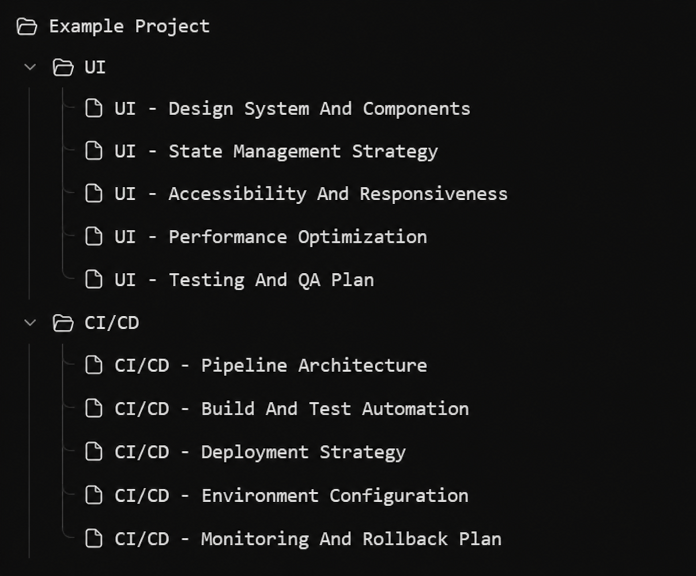

# Feature request: nested, reorganizable Codex tasks

## Summary

Add project-scoped topic groups and parent/child task relationships to Codex so long-running work can be organized by subject, lineage, and active milestone instead of appearing as one flat list.

This would let continuation tools such as `gp-relay` create a successor task under the topic it belongs to, preserve its relationship to the predecessor, and keep the sidebar aligned with the project's actual structure.



*Illustrative hierarchy: a saved project contains topic groups such as UI and CI/CD, with related tasks nested beneath each group. This is a concept, not a current Codex interface.*

## Problem

A complex project can produce many legitimate Codex tasks: design-system work, state-management decisions, accessibility reviews, build automation, deployment planning, and more. A flat chronological list loses three important relationships:

1. **Topic:** which workstream the task belongs to.
2. **Lineage:** which task handed work to which successor.
3. **Sequence:** where a task sits inside a longer milestone or relay chain.

Automatic successor naming helps, but names alone cannot express or reorganize these relationships. As the list grows, users must remember associations or encode hierarchy into increasingly long titles.

## Proposed experience

### Topic groups

- Allow a saved project to contain collapsible user-named topic groups.
- Allow groups to contain tasks and optional subgroups.
- Show the number of active, waiting, blocked, and completed tasks in a group without adding decorative analytics.
- Preserve a stable topic identifier when the visible group name changes.

### Task lineage

- Let a task record an optional predecessor and one or more successors.
- Show a lightweight “continued from” / “continued in” relationship in the task header.
- Provide a lineage view for following a relay chain without merging the task transcripts.
- Keep lineage separate from topic placement: a successor can remain related to its predecessor even if the user moves it to another topic.

### Reorganization

- Support drag-and-drop and keyboard-accessible move actions.
- Allow moving an existing task between topic groups without changing its saved-project identity.
- Make every move reversible and visible in task metadata.
- Do not silently reorganize tasks based only on model inference; show a suggestion or require an explicit tool request.

### Task-creation controls

Expose host capabilities equivalent to:

```text
create_topic(project_id, title, parent_topic_id?)
create_thread(project_id, title, prompt, topic_id?, predecessor_thread_id?)
set_thread_topic(thread_id, topic_id?)
set_thread_predecessor(thread_id, predecessor_thread_id?)
list_thread_tree(project_id)
```

The exact API shape can differ. The important contract is that creation returns authoritative identifiers and that placement, lineage, and persisted title can all be read back and verified.

## `gp-relay` integration

The relay envelope could add optional placement metadata:

```text
GP_RELAY_TOPIC_KEY: ui
GP_RELAY_TOPIC_TITLE: UI
GP_RELAY_PREDECESSOR_THREAD_ID: <thread id>
```

At handoff time, `gp-relay` would:

1. resolve the exact saved project;
2. reuse an existing stable topic ID when available;
3. create the successor with its topic and predecessor relationship;
4. verify persisted title, topic placement, lineage, and READY state; and
5. fail closed if identity or placement is ambiguous.

Topic inference should be conservative. A new topic is warranted when the active work requires a materially different working set, authority set, or outcome—not for every substep. The UI should make the chosen placement visible and reversible.

## Acceptance criteria

- A user can create, rename, collapse, reorder, and delete an empty topic group.
- A user can move a task between groups with mouse, touch, or keyboard controls.
- Moving a task does not alter its transcript, project identity, goal state, or lineage.
- A task can expose predecessor and successor links independently of its topic.
- Task-creation tools can request topic placement and predecessor lineage.
- The host returns authoritative IDs and read-after-write state for verification.
- Automated placement is visible, reversible, and permission-aware.
- Existing flat projects continue to work without migration.
- Search can filter by project, topic, lineage, state, and title.
- Private task content is not used to create public labels or metadata.

## Non-goals

- Replacing filesystem folders or repository structure.
- Merging transcripts from related tasks.
- Treating visual nesting as authorization to share context broadly.
- Automatically moving tasks without an observable user or tool action.
- Requiring every project to adopt a hierarchy.

## Why it matters

Fresh-task continuation is most useful when the resulting tasks remain understandable later. Nesting turns context rotation from a token-management technique into a durable project-navigation model: each task can stay focused, each handoff remains traceable, and the project sidebar reflects the work's real conceptual structure.
