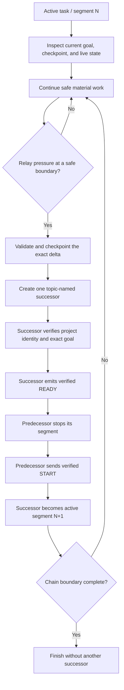

# How `gp-relay` works

`gp-relay` is a versioned continuation protocol for moving unfinished work through a recurring chain of fresh, visible Codex tasks without overlapping execution. It automates the handoff that `gp` leaves to the user while preserving exact project identity, frozen completion boundaries, validation evidence, and a recoverable successor handshake.

The current package implements GP Relay Protocol v3 and is explicit-only.

## Modes

| Invocation | Chain boundary |
|---|---|
| `$gp-relay` | Complete the next evidence-backed major milestone |
| Exact `$gp-relay 0` | Continue through successive safe slices with no overall completion boundary |
| `$gp-relay <hint>` | Preserve the exact hint and freeze observable completion gates |

Once a managed chain exists, its mode, hint, gates, and ultimate objective remain frozen. A later modifier cannot silently rewrite the boundary.

## Relay lifecycle

### 1. Enter or resume

The relay resolves one exact saved project, canonical root, and environment class, then inspects the current goal:

- an existing v3 segment continues its chain;
- an older relay segment preserves its metadata and migrates the successor to v3;
- a complete/blocked ordinary goal or no goal seeds a new chain; and
- an unrelated active ordinary goal requires a real stop, cancel, or supersede operation before any successor can be created.

The relay never marks an unfinished ordinary goal complete merely to make handoff mechanics easier.

### 2. Continue until a useful boundary

The predecessor keeps doing meaningful safe work. It looks one slice ahead for hard decisions, defaults reversible local choices, parks only work that truly requires authorization, and continues independent queues.

Relay pressure is based on observable signals: explicit invocation, an explicit compaction/context warning, or four completed material-work turns after START. Readiness checks, recovery, waiting, and user-only turns do not count. The protocol does not invent token arithmetic.

When the evidence shows that the active work has moved to a materially different workstream, the active milestone changes with it. That creates a natural topic boundary for the next relay instead of splitting every minor substep. The active milestone supplies the successor's topic-aware title: `<Project> - <Active milestone>`, with a part number only when the same milestone continues.

### 3. Create one successor for this handoff

At the safe handoff boundary, the predecessor finishes or unwinds the atomic operation, validates proportionately, updates the existing checkpoint, creates one successor, and retains its exact task ID. The successor receives a self-contained envelope containing chain, handoff, segment, project, mode, hint, completion gates, active milestone, and objective fields.

One handoff creates one successor, but the relay chain is not limited to one handoff. After verified START, segment N+1 becomes the active predecessor for a later handoff to segment N+2. This repeats through as many topic-named tasks as needed until the frozen completion boundary is verified or a genuine hard boundary leaves no safe work.

### 4. Verify READY before stopping

The successor performs a deliberately minimal readiness phase. It validates the exact saved project and goal but does not read project docs, run tests, or begin material work. Only an assistant-authored, exact `GP_RELAY_READY` control from the retained successor counts as readiness.

Notification text, titles, user-authored text, quoted controls, and ambiguous tool results are not proof.

### 5. Stop, then START once

Only after READY is verified does the predecessor stop its managed segment and send the matching START control. The successor begins material work once. Duplicate READY or START controls are no-ops, so recovery cannot accidentally create overlapping execution.

## Recovery model

Ambiguity never authorizes a replacement successor. Creation, rename, readiness, stop, or START failures retain the same handoff identity and use bounded re-reads or retries. If proof remains unavailable, the relay reports an exact recovery state and stops safely.

This fail-closed model is intentionally stricter than a casual "open a new task and continue" workflow. Duplicate successors are more damaging than a visible handoff that needs recovery.

## Benefits

- **Recurring context rotation:** repeats verified handoffs at material project boundaries instead of treating one fresh task as the final destination.
- **No overlapping agents:** the successor cannot begin project work before the predecessor is verified stopped.
- **Topic-aware navigation:** each successor is named for the active milestone it owns.
- **Exact lineage:** chain, segment, predecessor, project, and handoff identifiers preserve provenance.
- **Recoverable failure:** ambiguous success retains one successor rather than creating duplicates.
- **Approval-aware progress:** hard-boundary work can wait while independent safe work continues.
- **Compact continuation:** the successor loads the checkpoint and current delta rather than an undifferentiated conversation history.

## Current Codex integration notes

- The invocation must occur in a saved Codex project with an exact resolvable project identity.
- The Codex host must expose task creation, task reading, task naming, task messaging, and goal-state operations.
- Current Codex versions do not expose an exact live token meter to the skill. The relay uses host context warnings and bounded material-work turns.
- Topic naming is derived from the active milestone; current Codex task lists do not provide true nested topic placement.
- Each handoff creates one successor in the background but does not navigate the UI or auto-open it. Once started, that successor may perform the next handoff in the chain.
- The relay may update an existing project checkpoint as part of an exact handoff.
- Unresolved identity, unsafe checkpoint state, unavailable authorization, or ambiguous handshake proof fails closed.

True topic nesting and post-creation reorganization require host support. See the [OpenAI feature request](../FEATURE_REQUEST.md).

The installable source and full state-machine references are in [`plugins/goal-workflows/skills/gp-relay`](../plugins/goal-workflows/skills/gp-relay/).
